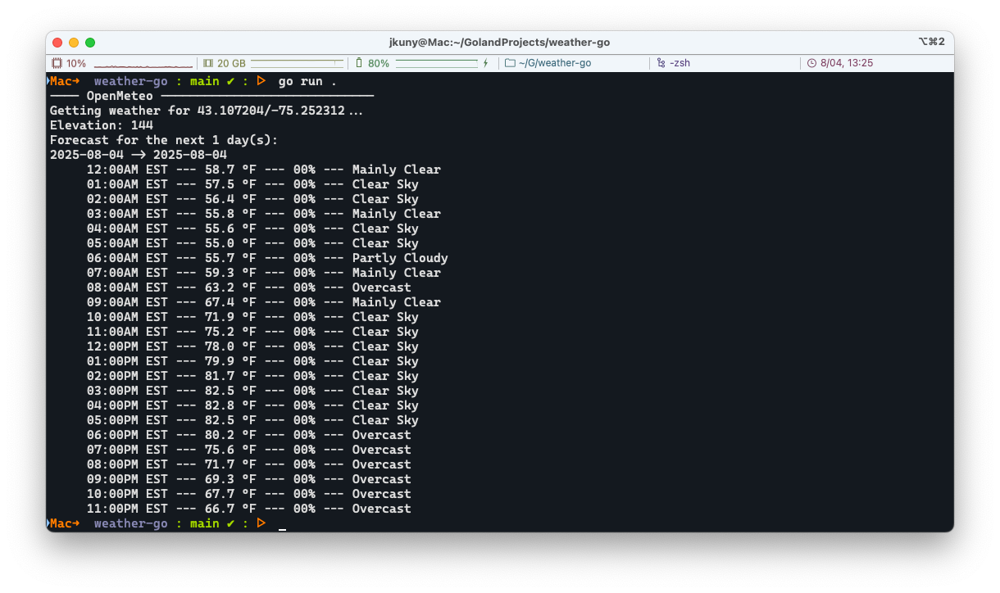

# Weather-Go

A basic CLI weather application. Allows for using multiple sources.



## Usage

```shell
# Get the default location's weather
weather-go 

# Update your default location using the `-l` latitude and `-g` longitude flags
weather-go configure -l -0.00 -g -0.00

# View your configurations
weather-go configure print
```

## Installation

```shell
go build .
```

```shell
go run main.go <command>
```

## Reference Notes

- [Basic HTTP Request](https://www.slingacademy.com/article/how-to-send-get-requests-with-params-in-go/#step-3:-create-a-http-client)
- [Open Meteo Documentation](https://open-meteo.com/en/docs)
- [Open Weather Map Documentation](https://openweathermap.org/api)

